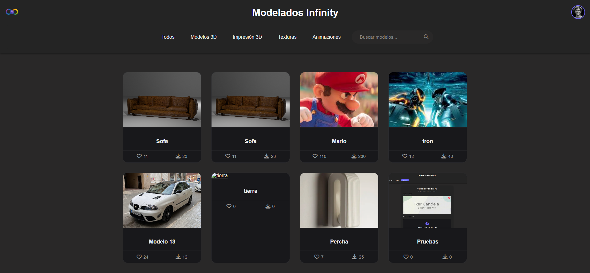
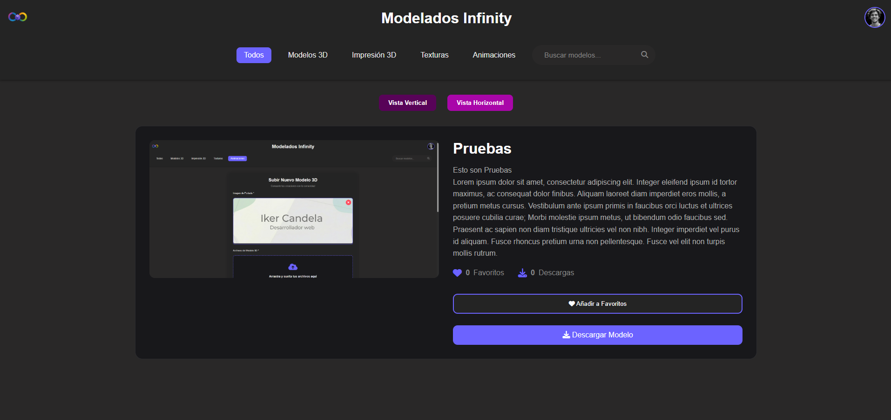
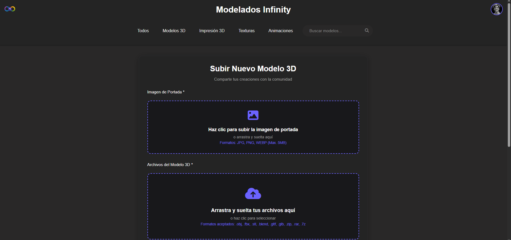

Modelados Infinity ♾️

Proyecto personal orientado a compartir recursos 3D para creadores y desarrolladores.

La plataforma permite a los usuarios explorar, subir y descargar contenido relacionado con modelado 3D para diferentes usos, como proyectos en Blender o impresión 3D.

Características principales
📦 Catálogo de modelos 3D
🌍 Biblioteca de texturas
🖨️ Modelos para impresión 3D
🔎 Sistema de búsqueda y filtrado
👤 Personalización de perfil de usuario
⬆️ Subida de archivos por parte de usuarios autorizados
☁️ Integración con la API de Google Drive para almacenamiento y descargas

Capturas

Página principal

Detalle de modelo

Subida de modelo

Estado del proyecto

🛠️ En desarrollo activo
El proyecto sigue en fase de mejora y ampliación de funcionalidades.

Objetivo del proyecto

Crear una plataforma donde la comunidad pueda compartir y encontrar recursos 3D de forma sencilla y organizada.

Tecnologías utilizadas
PHP
MySQL
JavaScript
API de Google Drive
Feedback

Cualquier sugerencia o feedback es bienvenido.
